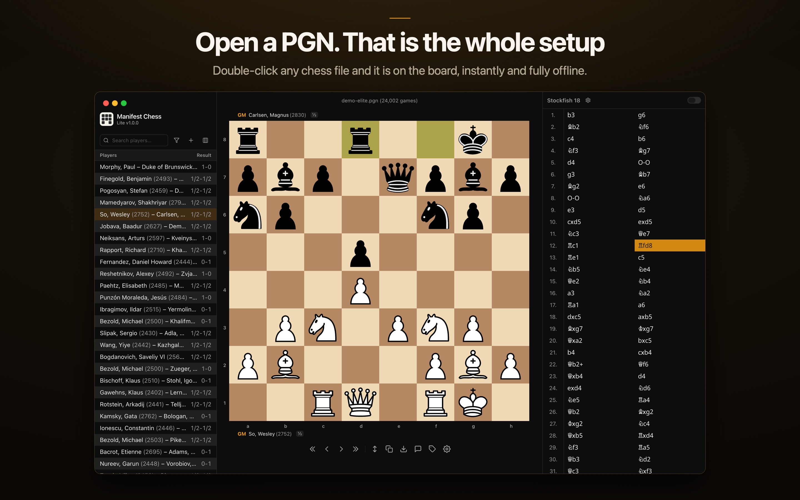

# Manifest Chess Lite - offline PGN reader, viewer & editor for Mac

 

**Manifest Chess Lite** is a fast, fully offline **PGN reader, viewer and editor for macOS**. Open any chess `.pgn`, step through the games with a built-in Stockfish engine, annotate with variations and symbols, and save back without rewriting anything you didn't touch. No account, no network, no tracking.

This repository holds the complete source, released under the GPL.

**[Download on the Mac App Store](https://apps.apple.com/app/id6809753832)** | **[www.manifestchess.com/lite](https://www.manifestchess.com/lite/)**

## What it does

- Opens `.pgn` files and previews them in Quick Look; large multi-game databases load and scroll smoothly.
- Runs Stockfish locally in WebAssembly for multi-line analysis - nothing to install or configure.
- Searches and filters games by player, rating, year, colour or result.
- Edits games: comments, variations, glyphs, arrows and highlights; create a game or start from a FEN.
- Saves byte-faithfully - parts of the file it wasn't asked to change are preserved exactly.
- Light or dark theme, board colours, piece sets and sounds.

## Built with

Electron, React, TypeScript, [chessground](https://github.com/lichess-org/chessground), [chessops](https://github.com/niklasf/chessops), and [Stockfish](https://github.com/official-stockfish/Stockfish) (WebAssembly).

## Licence

Manifest Chess Lite is free and open-source software under **GPL-3.0-or-later** - see [`LICENSE`](LICENSE). It bundles third-party components under their own free-software licences (Stockfish; chessground/chessops; art & sound assets from lichess-org/lila); each is credited in [`COPYING.md`](COPYING.md).

Made by [Manifest Chess](https://www.manifestchess.com).
